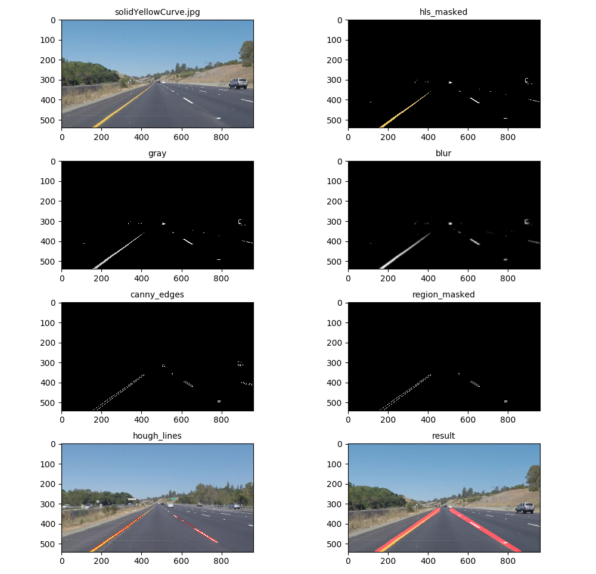
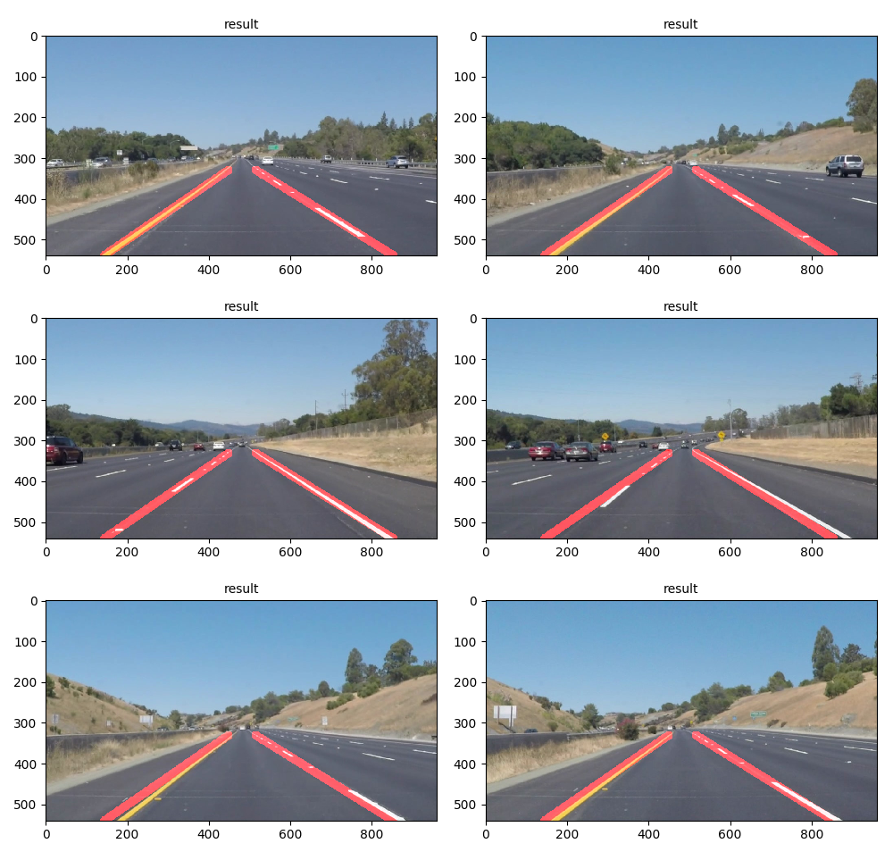

# **Finding Lane Lines on the Road** 

[](https://www.youtube.com/watch?v=nrJ2Y6M46r8 "Finding Lane Lines on the Road")
[Watch on Youtube](https://www.youtube.com/watch?v=1BTBnllGh1o)

Overview
---

When we drive, we use our eyes to decide where to go.  The lines on the road that show us where the lanes are act as our constant reference for where to steer the vehicle.  Naturally, one of the first things we would like to do in developing a self-driving car is to automatically detect lane lines using an algorithm.

In this project I will go throught the steps needed to succesfully detect lane lines in images and in a video stream using Python and OpenCV. The pipline for line identification takes road images from a viedo as input and returns an annotated video stream as output.

This is the first of the projects in the Self Driving Car Engineer Nanodegree Program from [Udacity](https://www.udacity.com/course/self-driving-car-engineer-nanodegree--nd013).

Pipeline
---
The complete pipeline is presented in the Jupyter file provided and consists of the following steps:
* Color selection
* Canny edge detection
* Region of interest selection
* Line detection by Hough transformation
* Lines averaging and extrapolation

Input Images
---
We start with reading the input images. Some of the test images are:

<table>
  <tr>
    <td></td>
    <td></td>
  </tr>
  <tr>
    <td></td>
    <td></td>
  </tr>
</table>

Color Selection
---
Reading images is done with a **matplotlib** function:
```python
import matplotlib.image as mpimg
image = mpimg.imread('test_images/solidYellowCurve.jpg')
```


In this case images are loaded in RGB space, which might not be the most suitable format for extracting yellow and white lines, especially if there are shadows on the road.

After some experimentation I found that the best results are if we transform the image into HLS space and then extract the yellow and white colors:
```python
def mask_white_yellow_hls(image):
    converted = cv2.cvtColor(image, cv2.COLOR_RGB2HLS)
    # white
    lower = np.uint8([0, 200, 0])
    upper = np.uint8([255, 255, 255])
    white_mask = cv2.inRange(converted, lower, upper)
    # yellow
    lower = np.uint8([10, 0, 100])
    upper = np.uint8([40, 255, 255])
    yellow_mask = cv2.inRange(converted, lower, upper)
    # combine
    mask = cv2.bitwise_or(white_mask, yellow_mask)
    return cv2.bitwise_and(image, image, mask=mask)
```

Canny Edge Detection
---
The Canny edge detector is an edge detection operator that uses a multi-stage algorithm to detect a wide range of edges in images. It was developed by John F. Canny in 1986.
From the OpenCV we call it with:
```python
cv2.Canny(img, low_threshold, high_threshold)
```
The thresholds need to be estimated empiricaly. Canny recommended an upper:lower ratio between 2:1 and 3:1.
I've got the best results with thresholds set to _low_threshold=50_ and _high_threshold=150_.

The _Canny_ function expects a grayscale image, which should be smoothed by applying _GaussianBlur_ to eliminate rough edges. All three functions are:

```python
def grayscale(img):
    return cv2.cvtColor(img, cv2.COLOR_RGB2GRAY)

def gaussian_blur(img, kernel_size=15):
    return cv2.GaussianBlur(img, (kernel_size, kernel_size), 0)
    
def canny(img, low_threshold=50, high_threshold=150):
    return cv2.Canny(img, low_threshold, high_threshold)
```

Region of interest selection
---
We are only interested in the part of the image with lane lines and keep the region of the image defined by the polygon
formed from definde vertices. The rest of the image is set to black.
```python
def region_of_interest(img, vertices):
    #defining a blank mask to start with
    mask = np.zeros_like(img)   
    #defining a 3 channel or 1 channel color to fill the mask with depending on the input image
    if len(img.shape) > 2:
        channel_count = img.shape[2]  # i.e. 3 or 4 depending on your image
        ignore_mask_color = (255,) * channel_count
    else:
        ignore_mask_color = 255
    #filling pixels inside the polygon defined by "vertices" with the fill color    
    cv2.fillPoly(mask, vertices, ignore_mask_color)
    #returning the image only where mask pixels are nonzero
    masked_image = cv2.bitwise_and(img, mask)
    return masked_image
```

Hough Transform Line Detection
---
The Hough transform takes a binary edge map (output of a Canny transform) as input and attempts to locate edges placed as straight lines.
```python
def hough_lines(img, rho, theta, threshold, min_line_len, max_line_gap):
    return cv2.HoughLinesP(img, rho, theta, threshold, np.array([]), minLineLength=min_line_len, maxLineGap=max_line_gap)
```
The parameters are:
* rho: Distance resolution of the accumulator in pixels.
* theta: Angle resolution of the accumulator in radians.
* threshold: Accumulator threshold parameter. Only those lines are returned that get enough votes (> threshold).
* minLineLength: Minimum line length. Line segments shorter than that are rejected.
* maxLineGap: Maximum allowed gap between points on the same line to link them.
The parameter values that I have used are:
```python
cv2.HoughLinesP(image, rho=1, theta=np.pi/180, threshold=20, minLineLength=20, maxLineGap=300)
```

Lines averaging and extrapolation
---
Hough transform produces multiple lines for each lane. These lines need to be averaged, connected and extrapolated.
```python
def average_lanes(lines):
    left_lines = []
    left_length = []
    right_lines = []
    right_length = []

    for line in lines:
        for col1, row1, col2, row2 in line:
            if col2 == col1:
                continue  # skip if it is a vertical line
            slope = (row2 - row1) / (col2 - col1)
            intercept = row1 - slope * col1
            length = np.sqrt((row2 - row1) ** 2 + (col2 - col1) ** 2)
            if slope < 0:  # y is reversed in a matplotlib image
                left_lines.append((slope, intercept))
                left_length.append((length))
            else:
                right_lines.append((slope, intercept))
                right_length.append((length))

    left_lane = None
    right_lane = None

    # prefer longer lines
    if len(left_length) > 0:
        left_lane = np.dot(left_length, left_lines) / np.sum(left_length)

    if len(right_length) > 0:
        right_lane = np.dot(right_length, right_lines) / np.sum(right_length)

    return left_lane, right_lane
```
In the function above, we first identify left and right lines by the slope (the left lane should have a positive slope, and the right lane should have a negative slope). Then we average the lines by averaging the _slope_ and _intercept_.
We return the _left_lane_ and _right_lane_ as _(slope, intercept)_ tuple.

From the _slope_ and _intercept_ we need to reconstruct the lines:
```python
def get_points(row_bottom, row_top, line):
    if line is None:
        return None
    slope, intercept = line
    col_bottom = int((row_bottom - intercept) / slope)
    col_top = int((row_top - intercept) / slope)
    return ((col_bottom, int(row_bottom)), (col_top, int(row_top)))

def get_lane_lines(imshape, lines, row_top):
    left_lane, right_lane = average_lanes(lines)
    left_line = get_points(imshape[0], row_top, left_lane)
    right_line = get_points(imshape[0], row_top, right_lane)
    return left_line, right_line
```
The last step is to draw the lane lines on the image:
```python
def get_lane_lines_image(image, lines, color= [255, 0, 0], thickness=20):
    # create a new image to draw lines
    line_image = np.zeros_like(image)
    for line in lines:
        if line is not None:
            cv2.line(line_image, line[0], line[1], color, thickness)
    return cv2.addWeighted(image, 1.0, line_image, 0.95, 0.0)
```

When using the complete pipeline on a video stream, the lines need to be averaged once again for each image in the stream:
```python
import collections
QUEUE_MAX_LEN = 50
left_lines  = collections.deque(maxlen=QUEUE_MAX_LEN)
right_lines = collections.deque(maxlen=QUEUE_MAX_LEN)
def get_average_line(line, lines):
    if line is not None:
        lines.append(line)
    if len(lines)>0:
        line = np.mean(lines, axis=0, dtype=np.int32)
        line = tuple(map(tuple, line))
    return line
```
The complete pipeline is shown on the images below:

Some resulting images:

All steps can be reproduces by running the provided Jupyter notebook.

Conclusion
---
The project was successful since all lines were detected successfully even on the challenging video.

A drawback of this solution is that only straight lane lines are detected. By using for example poly fitting the algorithm could be changed so that it detects also curved lines. For the provided videos it is not a problem since the nearest lines to the car are straight.

Another problem is that the horizontal line as a top boundary of the lane lines is set explicitly, and works well only on if the road is not too steep. In that case, the top horizontal line would need to be estimated differently.


