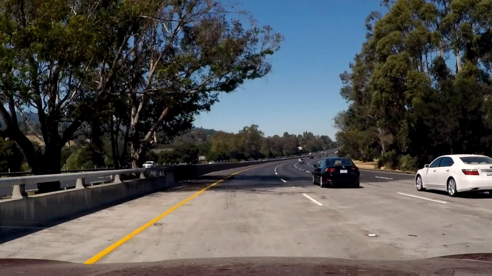
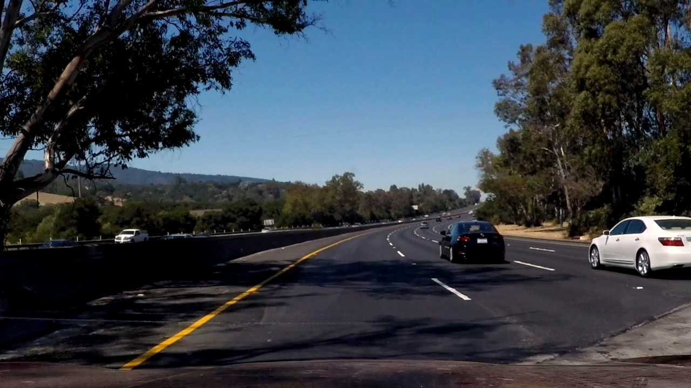

# **Finding Lane Lines on the Road** 

[More results on Youtube](https://www.youtube.com/watch?v=F7gluNuSx50&list=PL06vO3TcKwfYCAyu5FBqnhxylDzH1chP2)

Overview
---

When we drive, we use our eyes to decide where to go.  The lines on the road that show us where the lanes are act as our constant reference for where to steer the vehicle.  Naturally, one of the first things we would like to do in developing a self-driving car is to automatically detect lane lines using an algorithm.

In this project I will go throught the steps needed to succesfully detect lane lines in images and in a video stream using Python and OpenCV. The pipline for line identification takes road images from a viedo as input and returns an annotated video stream as output.

This is the first of the projects in the Self Driving Car Engineer Nanodegree Program from [Udacity](https://www.udacity.com/course/self-driving-car-engineer-nanodegree--nd013).

Pipeline
---
The complete pipeline is presented in the Jupyter file provided and consists of the following steps:
* Color selection
* Canny edge detection
* Region of interest selection
* Line detection by Hough transformation
* Lines averaging and extrapolation

Input images
---
We start with reading the input images. Some of the test images are:

<table>
  <tr>
    <td></td>
    <td></td>
  </tr>
  <tr>
    <td></td>
    <td></td>
  </tr>
</table>

